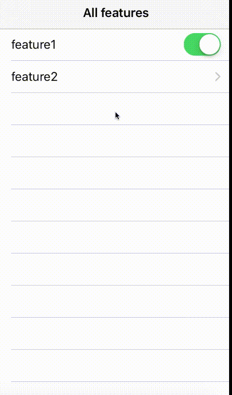

# RFFeatureToggle

[](https://travis-ci.org/raumfeld/RFFeatureToggle)
[](https://codecov.io/github/raumfeld/RFFeatureToggle/coverage.svg?branch=master)
[](http://cocoapods.org/pods/RFFeatureToggle)
[](http://cocoapods.org/pods/RFFeatureToggle)
[](http://cocoapods.org/pods/RFFeatureToggle)

## About

A simple A/B testing framework for remotely switching features on and off and having the changes reflect in the app immediately.

## Usage

### Setup

Initialize the defaults with **params**, a dictionary containing base URLs for staging and production.

```objective-c
NSDictionary *params = @{kRFFeatureToggleBaseURLStringForStagingKey : @"https://staging/",
						 kRFFeatureToggleBaseURLStringForProductionKey : @"https://production/"};
                             
[RFFeatureToggleDefaults sharedDefaultsWithMode:RFFeatureToggleModeProduction params:params];
```

For an easy start there are 3 convenience methods:

### Check if a feature is enabled

```objective-c
[RFeatureToggle isEnabled:@"feature"];
```

If the API supports features within features within features, these can be separated with dots like

```objective-c
[RFeatureToggle isEnabled:@"feature.subfeature.subsubfeature"];
```

### Refresh all features and cache them

```objective-c
[RFeatureToggle refresh];
```

This can be called on `applicationDidBecomeActive:` or whenever convenient. After the initial call the features are automatically refreshed after 24 hours if app has been continuously running in foreground. A custom time interval can be set as default, for example `[RFFeatureToggleDefaults sharedDefaults].refreshTimeInterval = 120.0f;`.

### Fetch all features from the cache

```objective-c
NSArray *features = [RFeatureToggle allFeatures];
```

## Extras

### Observing updates

Subscribe to `RFFeatureToggleUpdatedNotification` to receive updates. The notification is triggered only when there has been a change in features.

### Switching between modes

To switch between staging and production use `[RFFeatureToggleDefaults switchToMode:RFFeatureToggleModeProduction]`. Alternatively, to switch to custom URL that was not provided on initialization, there's a convenience method `[RFFeatureToggleDefaults switchToCustomModeWithBaseURLString:@"https://testURL"]`. Calling `[RFFeatureToggleDefaults sharedDefaults].mode)]` will return the mode it's operating in (production, staging, custom).

### Fine tuning
For fine tuning check the [CococaDocs](http://cocoadocs.org/docsets/RFFeatureToggle). 

### Inspection
To inspect the features, there are convenience methods in `RFFeature` class:

* **description**, example output:

```
feature2: disabled
```

* **recursiveDescription**, example output:

```
feature2: disabled	
	|_feature3: disabled		
		|_feature5: disabled
		|_feature6: enabled
	|_feature4: enabled
```

### RFFeatureTableViewController

`RFFeatureTableViewController` lists all features that can be navigated through. It has a refresh control so features can be refreshed to ensure the latest changes are present. This is to be used for QA purposes.



This is demonstrated in the example project. To run the example project, run `pod install` from the Example directory first.

### Digging deeper

Aside convenience methods provided in `RFFeatureToggle` class, there are model-controller extensions of `RFFeature` based on [Data Mapper](http://martinfowler.com/eaaCatalog/dataMapper.html) design pattern, as well as `RFFeatureCache` class that handles persistence and auto update. Examples:

#### To handle error when fetching all features

```objective-c
[RFFeature fetchFeaturesUsingBlock:^(BOOL succeeded, NSError *error) {
	if (!succeeded)
	{
		//handle error
	}
}];
```

#### To inspect the date of last successful update

```objective-c
NSTimeInterval secondsSinceLastSuccessfulUpdate = [RFFeatureCache timeIntervalSinceLastSuccessfulUpdate];
if	(secondsSinceLastSuccessfulUpdate > 120.0f)
{
	//do something
}
```

## Requirements

* A server that returns a list of features in the specified format. See [Fixtures](Example/Tests/Fixtures) for an example of the response.
* iOS7+

## Installation

RFFeatureToggle is available through [CocoaPods](http://cocoapods.org). To install
it, simply add the following line to your Podfile:

```ruby
pod "RFFeatureToggle"
```

## Documentation

For a complete documentation see [CococaDocs](http://cocoadocs.org/docsets/RFFeatureToggle).

## License

RFFeatureToggle is available under the MIT license. See the LICENSE file for more info.
